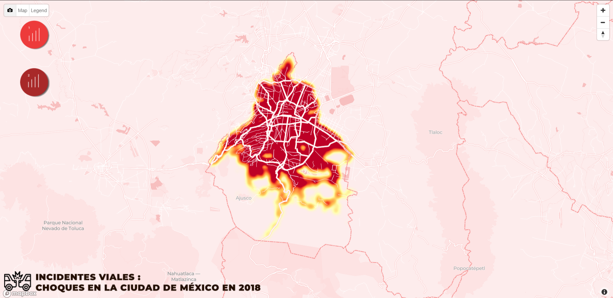

# Incidentes viales: choques en la Ciudad de México en 2018
### Isabel Larragain González
### Medios Digitales
### Visualización de datos
### Profesor: Adrian Santuario, MSc.
### Junio 2019
Se presenta un análisis de la base de datos de los incidentes viales ocurridos en la Ciudad de México, enfoncándose específicamente en el año 2018, cuyos datos se obtuvieron de Datos Abiertos de la Ciudad de México https://datos.cdmx.gob.mx/explore/?refine.theme=Movilidad&sort=modified. Se realizó una exploración de estos datos, así como gráficas y mapas interactivos para mostrar de una manera interesante y evidente, buscando que los usuarios que examinen los resultados tomen decisiones y precausiones viales con respecto a los datos mostrados.

Se puede ver el mapa en el siguiente enlace: https://isabellgg.github.io/choques-CDMX-2018/
